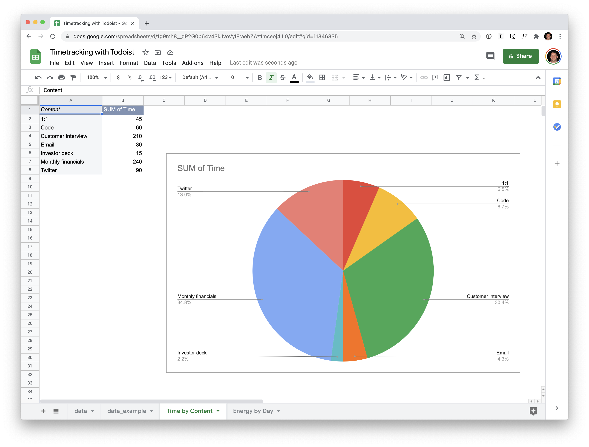

## Todoist Time Tracker 
A script to export items from a specific Project into an easy to analyze CSV format for time tracking analysis. Inspired by a related Twitter [thread](https://twitter.com/karrisaarinen/status/1352685228242784256).

### Add your Todoist API token to todoist-time-tracker.py

You can find your Todoist API token via "Setttings > Integrations > API Token"

### Add the project ID to todoist-time-tracker.py 

Add the ID for whatever project you want to export items from for time tracking purposes.

You can find this by visiting the project via Todoist's web app. Their URL structure is https://todoist.com/app/project/{project_id}

### Tags and CSV Format

The supports tags and format of the CVS data is highly customziable. For right now it supports the following time tags (in minutes): @15, @30, @45, @50, @75, @90, @105, @120. There is also an energy column that supports @drain and @gain tags.

### Tags and CSV Format Ideas

While I haven't added the following logic to the script yet, some ideas for future improvement are adding a column that categorizes the work as either:
1. Intentional: tasks that you planned to do that day
2. Meetings: meeting times
3. Reactive: tasks that poppped up during the day that you had to react to
4. Distractions: Time spent distracted from any productive tasks

### Example Spreadsheet
You can find an example spreadsheet [here](https://docs.google.com/spreadsheets/d/1g9mh8__dP2G0b64v4SkJvoVyIFraebZAz1mceoj4lL0/edit?usp=sharing).

### Video Demo
You can check out a demo of the workflow in action [here](https://www.loom.com/share/66aed12aa5f14cbdadb75754ef513b55).

### Questions or Comments
If you have any questions or comments feel free to reach out to me via twitter: https://twitter.com/ajwaxman.
